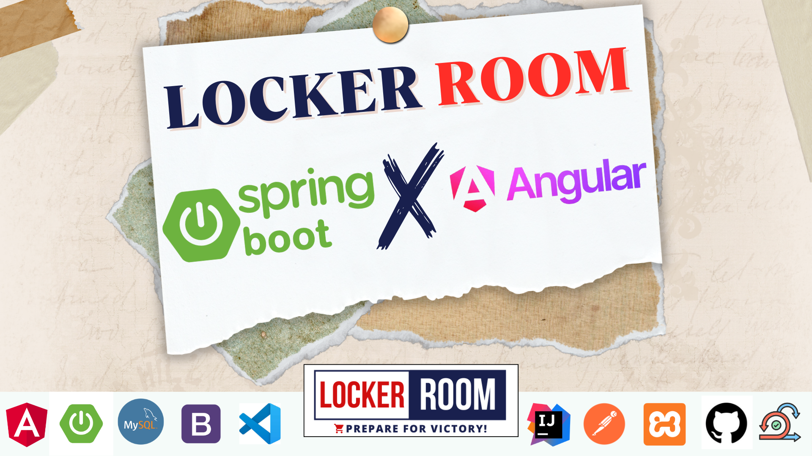

# LOCKER ROOM

**NB : Cette version n'est pas complète pour des raisons personnelles.**

## Description

**LOCKER ROOM** est une application web dédiée à la vente de matériel sportif. Elle permet aux utilisateurs de parcourir, rechercher, et acheter des articles sportifs en ligne. L'application offre une gestion efficace pour les administrateurs, avec un système complet de suivi des stocks et des commandes.

## Table des matières

1. [Fonctionnalités](#fonctionnalités)
2. [Technologies Utilisées](#technologies-utilisées)
3. [Installation](#installation)
4. [Utilisation](#utilisation)
5. [Contact](#contact)

## Fonctionnalités

- Parcourir et rechercher des produits sportifs.
- Gestion des produits et des stocks pour les administrateurs.
- Suivi des commandes en temps réel.
- Interface utilisateur conviviale et intuitive.
- Système de communication simplifié avec les fournisseurs.

## Technologies Utilisées

- **Frontend** : Angular
- **Backend** : Spring Boot
- **Base de données** : MySQL

## Installation

Pour installer l'application, configurez les environnements frontend (Angular) et backend (Spring Boot), ainsi que la base de données MySQL selon vos besoins.

## Utilisation

- **Administrateurs** : Accédez à l'interface d'administration pour gérer les produits, les stocks et les commandes.
- **Clients** : Parcourez les produits disponibles, ajoutez-les au panier, et finalisez vos achats facilement.

## Contact

Pour toute question ou suggestion, veuillez me contacter à : **votre.email@example.com**
